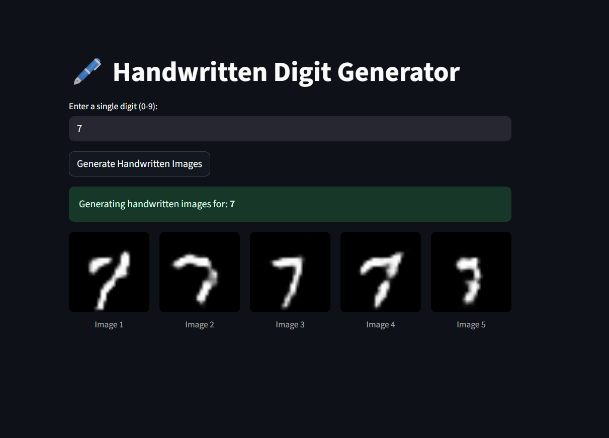

# ✨ Handwritten Digit Generator with CGAN

Generate realistic handwritten digit images using a Conditional GAN (CGAN) model, all through a simple and interactive web interface powered by Streamlit.

 <!-- تأكدي إن الصورة في المسار ده -->

🔗 **Live App**: [Try it here](https://blank-app-95e2ta2ltgj.streamlit.app/) 

---

## 💡 About the Project

This app allows users to input a single digit (0-9), and instantly generates **5 different** handwritten-style images of that digit using a pretrained Conditional GAN model.

The generator is trained on the MNIST dataset and leverages label conditioning to generate class-specific samples.

---

## 🚀 How to Use

1. Enter a digit (0 to 9) in the input box.
2. Click **"Generate Images"**.
3. View 5 AI-generated handwritten images of the digit.

---

## 🧠 Tech Stack

- [Streamlit](https://streamlit.io/)
- [TensorFlow / Keras](https://www.tensorflow.org/)
- [PIL (Python Imaging Library)](https://pillow.readthedocs.io/)

---
## 👩‍💻 Author

- Sama Yousef  
- 🌐 [LinkedIn](www.linkedin.com/in/sama-yousef-93001a201) <!-- لو عندك لينكدإن حطيه هنا -->

## 📦 Requirements

```bash
pip install streamlit tensorflow==2.18.0 pillow
